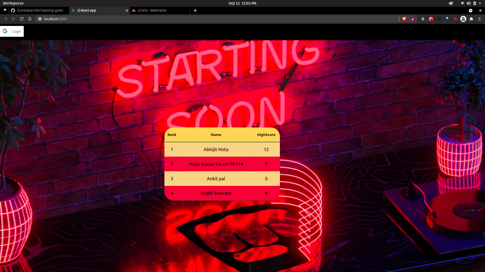
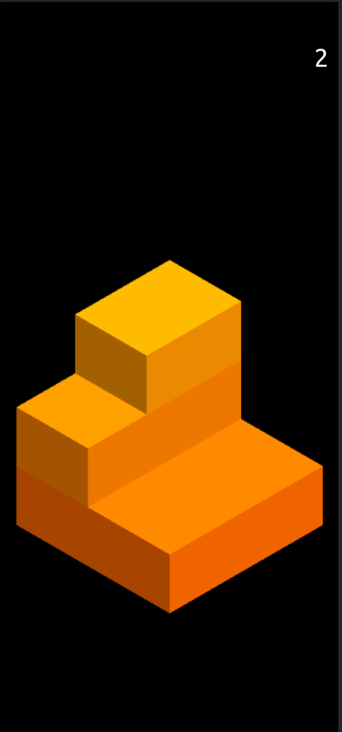

# Stacking Game (You legit stack blocks like a 9 year old)

### Try out the game over here
https://stackinggame.netlify.app/
`This isn't the completed version of the game
 I am working on deploying the backend with auth 
 and highscores so look out for that as well`

### Tech Stack used
* ThreeJS(3D rendering with WebGL)
* CannonJs(For adding Physics to the game)
* ReactJS
* Typegraphql(on the backend , not yet deployed)
* ApolloClient

### Images of the site

###           Home Page

###           Game on Desktop

### Game on Mobile

### To contribute to the project 

* *Step1* `git clone git@github.com:ankitpal1029/stacking-game-client.git`
* *Step2* `cd stacking-game-client`
* *Step3* `yarn install`
* *Step4* `yarn start`

This should set up your required dev environment to work on
